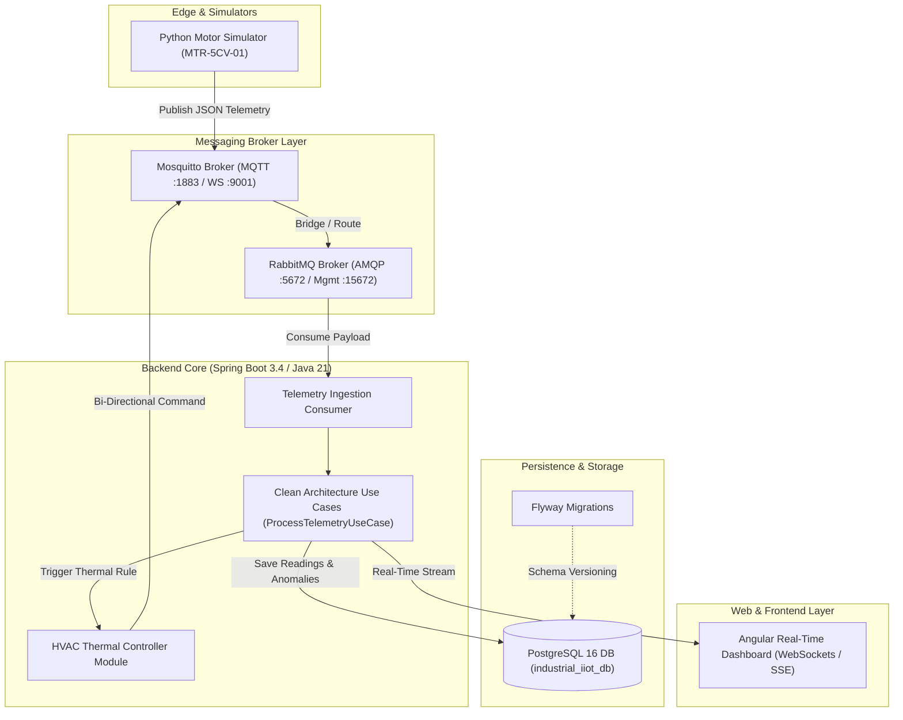

# 🏭 Industrial IIoT - Motor Telemetry & Machinery Health Monitoring


An **Industry 4.0 Industrial IoT (IIoT)** backend platform built for real-time electric motor telemetry processing, machinery health management, anomaly diagnosis, and automated thermal feedback actuation loops.

---

## 📌 Architectural Principles

- **Event-Driven Architecture (EDA):** High-throughput, asynchronous sensor ingestion and bi-directional actuation using Mosquitto (MQTT) and RabbitMQ (AMQP).
- **Clean & Hexagonal Architecture:** Strict Separation of Concerns. Core domain business logic is decoupled from frameworks, ensuring testability and longevity.
- **Quality Assurance & Verification:** Comprehensive unit and integration test coverage using JUnit 5, Mockito, and Testcontainers.
- **Container-First Environment:** 100% conteinerized local environment managed via Docker Compose.

---

## 🏗 System Architecture Diagram



---

## 🗺 Project Milestones & Current Progress

We follow an iterative milestone roadmap. Documented below is our current development status:

| Milestone | Scope & Objectives | Status |
| :--- | :--- | :---: |
| **Milestone 1** | **Infra & Ingestion Pipeline:** Docker Compose setup (PostgreSQL, Mosquitto, RabbitMQ) + Python Motor Simulator | COMPLETED ✅ |
| **Milestone 2** | **Database & Data Modeling:** Relational Schema (ERD), Time-Series indexing, Flyway DB Migrations | IN PROGRESS ⏳ |
| **Milestone 3** | **Core Domain & Clean Architecture:** Pure Java Domain Model, Use Cases, Async Ingestion Consumers | PLANNED 📋 |
| **Milestone 4** | **Frontend Integration & Real-Time:** Angular Dashboard, RxJS State, WebSockets / SSE streaming | PLANNED 📋 |
| **Milestone 5** | **Actuation & Feedback Loop:** Bi-directional MQTT commands (Emergency stop, speed throttling) | PLANNED 📋 |
| **Milestone 6** | **HVAC Control & Thermal Module:** Native internal HVAC thermal management engine | PLANNED 📋 |
| **Milestone 7** | **Enterprise Security & Observability:** Spring Security (JWT), Actuator metrics, Swagger / OpenAPI | PLANNED 📋 |

---

## ⚡ Tech Stack

- **Core Backend:** Java 21 LTS, Spring Boot 4.1.x, Spring Data JPA, Flyway DB
- **Messaging Brokers:** Eclipse Mosquitto v2 (MQTT / WebSockets), RabbitMQ 3.13 (AMQP)
- **Database:** PostgreSQL 16 (Time-series indexed)
- **IoT Simulators:** Python 3.10+, Paho-MQTT 2.x
- **Frontend (Upcoming):** Angular, RxJS, Chart.js / ngx-charts
- **DevOps & Tools:** Docker, Docker Compose, Git, Linux Mint

---

## 📊 Telemetry Data Specification

The simulator models industrial 3-phase electric motors (e.g., 5CV, 380V operating under ISO 20816 vibration guidelines).

### MQTT Topic Format
`industry/machinery/{equipmentCode}`

### Sample Payload
```json
{
  "equipmentCode": "MTR-5CV-01",
  "timestamp": "2026-08-24T15:30:00.123456",
  "readings": [
    {
      "sensorCode": "VOLTAGE",
      "value": 382.45
    },
    {
      "sensorCode": "CURRENT",
      "value": 7.82
    },
    {
      "sensorCode": "TEMPERATURE",
      "value": 68.30
    },
    {
      "sensorCode": "VIBRATION",
      "value": 1.45
    }
  ]
}
```

---

## 🚀 Getting Started & Local Setup

### 1. Prerequisites
- [Docker & Docker Compose](https://docs.docker.com/get-docker/)
- [Java 21 JDK](https://adoptium.net/)
- [Python 3.10+](https://www.python.org/)

### 2. Clone the Repository
```bash
git clone https://github.com/igorhgds/industrial-iot-backend.git
cd industrial-iot-backend
```

### 3. Spin up Infrastructure Containers
Start PostgreSQL, Mosquitto MQTT, and RabbitMQ in background mode:
```bash
docker compose up -d
```

Verify service ports:
- **PostgreSQL:** `localhost:5432` (DB: `industrial_iiot_db`, User: `iiot_user`)
- **Mosquitto MQTT:** `localhost:1883` (MQTT), `localhost:9001` (WebSockets)
- **RabbitMQ:** `localhost:5672` (AMQP), `http://localhost:15672` (Management Console — User: `iiot` / Pass: `iiot`)

### 4. Run the Motor Telemetry Simulator
Set up a Python virtual environment and run the simulator:
```bash
cd simulators
python3 -m venv venv
source venv/bin/activate  # On Windows: venv\Scripts\activate
pip install -r requirements.txt
python main.py
```
You will see real-time JSON telemetry payloads being published to Mosquitto MQTT topic `industry/machinery/MTR-5CV-01` every 3 seconds.

---

## 📂 Repository Project Structure

```
industrial-iot-backend/
├── docker-compose.yml           # Local infrastructure stack (Postgres, Mosquitto, RabbitMQ)
├── GITHUB_BACKLOG.md            # Detailed milestone tasks & issue definitions
├── infra/                       # Infrastructure configuration files
│   └── mosquitto/
│       └── config/
│           └── mosquitto.conf   # Mosquitto listener & WebSocket settings
├── simulators/                  # Python IIoT telemetry simulators
│   ├── main.py                  # Entry point for telemetry publisher
│   ├── motor_simulator.py       # 5CV 380V Motor telemetry logic
│   └── requirements.txt         # Paho-MQTT dependencies
├── src/                         # Spring Boot application source code
│   ├── main/
│   │   ├── java/                # Clean Architecture layers (Domain, Use Cases, Controllers)
│   │   └── resources/
│   │       ├── application.yaml # Spring Boot configurations
│   │       └── db/migration/    # Flyway SQL migration scripts
│   └── test/                    # JUnit 5 & Mockito test suites
└── pom.xml                      # Maven dependencies & build setup
```

---

## 📜 Backlog & Sprint Tracking

For a complete breakdown of user stories, acceptance criteria, and issue specifications, refer to [GITHUB_BACKLOG.md](file:///media/igor/Projetos/00%20-%20Web%20Developer/01%20-%20Projetos/Industrial_IoT/industrial-iot-backend/GITHUB_BACKLOG.md) or visit our [GitHub Project Board](https://github.com/users/igorhgds/projects/5).

---

## 📄 License
This project is licensed under the MIT License - see the LICENSE file for details.
