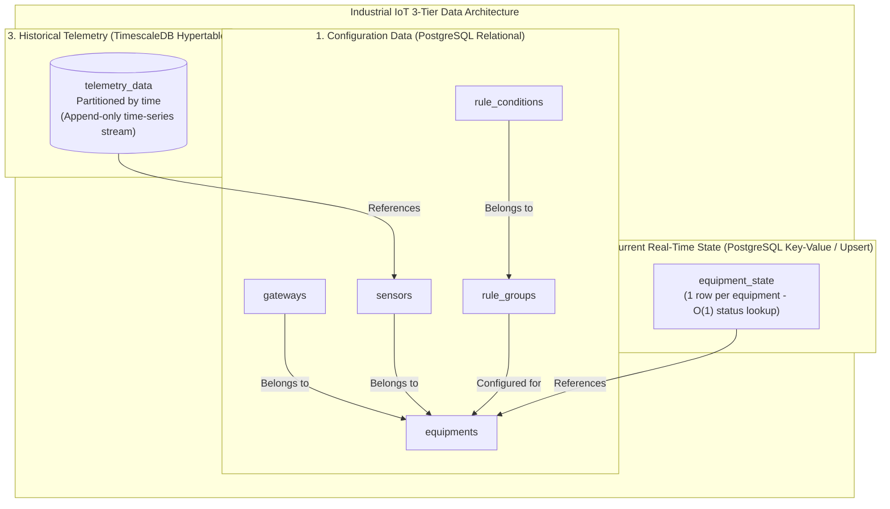
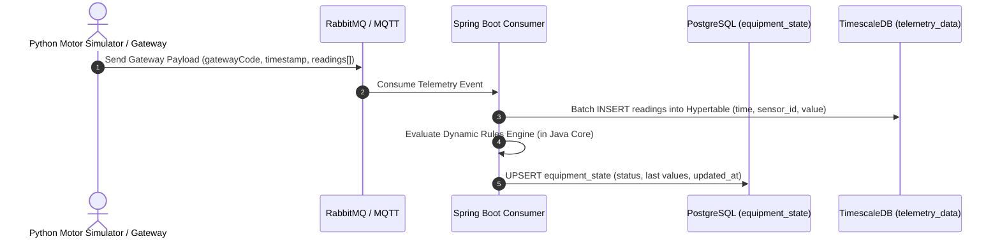

# 🐘 TimescaleDB & Time-Series Data Architecture

## 1. Overview & Architectural Rationale

In Industrial IoT (IIoT) platforms, telemetry data generated by machinery sensors grows exponentially over time. Standard relational databases (B-tree indexed tables) suffer severe write performance degradation and index bloat when scaling to millions or billions of rows.

To solve this without introducing complex NoSQL stacks or altering Spring Boot / PostgreSQL tooling, we utilize **TimescaleDB**—a native time-series extension for PostgreSQL 16.

### Key Benefits of TimescaleDB for IIoT:
- **Hypertables (Automatic Partitioning):** Data is automatically chunked into time-based partitions (e.g., 7-day chunks). Ingestion rate remains flat even with billions of rows.
- **Relational Joins:** Telemetry tables can be seamlessly joined with relational configuration metadata (`equipments`, `sensors`, `gateways`, `rule_groups`).
- **100% PostgreSQL Compatibility:** Uses standard JDBC drivers, SQL syntax, and Flyway migration tools.
- **Advanced Storage Features:** Built-in columnar compression (up to 90% space reduction) and continuous aggregates for automated downsampling (hourly/daily averages).

---

## 2. Three-Tier Data Architecture Separation

Our database design strictly separates three distinct data access patterns into dedicated storage models:



| Tier | Concept | Storage Engine | Query Pattern | Characteristic |
| :--- | :--- | :--- | :--- | :--- |
| **4.1 Configuração** | Equipments, Sensors, Gateways, Rules | Standard PostgreSQL | Low write, frequent `JOIN` queries | Relational integrity |
| **4.2 Estado Atual** | Equipment State (health status, last temp/vib) | `equipment_state` Table | $O(1)$ fast single-row read | Fast upsert, no historical scanning |
| **4.3 Histórico** | Telemetry Measurement Log | TimescaleDB Hypertable | High-throughput append-only writes | Time-partitioned, compression-ready |

---

## 3. TimescaleDB Hypertable Configuration

### 3.1 Enabling the Extension (`V09__enable_timescaledb.sql`)
```sql
CREATE EXTENSION IF NOT EXISTS timescaledb;
```

### 3.2 Hypertable Creation & Schema Definition (`V11__convert_telemetry_to_hypertable.sql`)
TimescaleDB hypertables do not use artificial UUID primary keys. Instead, the natural key is a composite of `(sensor_id, time)`.

```sql
-- 1. Create time-series table schema
CREATE TABLE telemetry_data (
    time        TIMESTAMPTZ     NOT NULL,
    sensor_id   UUID            NOT NULL,
    value       NUMERIC(15, 2)  NOT NULL,
    raw_payload TEXT
);

-- 2. Convert standard table to TimescaleDB Hypertable (chunked by time)
SELECT create_hypertable('telemetry_data', by_range('time'));

-- 3. Create high-performance composite index for sensor history queries
CREATE INDEX idx_telemetry_sensor_time 
    ON telemetry_data (sensor_id, time DESC);
```

---

## 4. Docker Container Configuration

TimescaleDB is packaged as a standard Docker image built on top of PostgreSQL 16 Alpine.

### `docker-compose.yml` Service Configuration:
```yaml
services:
  postgres:
    image: timescale/timescaledb:latest-pg16
    container_name: iiot-postgres
    environment:
      POSTGRES_USER: iiot_user
      POSTGRES_PASSWORD: 135790
      POSTGRES_DB: industrial_iiot_db
    ports:
      - "5432:5432"
    volumes:
      - postgres_iiot:/var/lib/postgresql/data
    networks:
      - iiot-network
```

---

## 5. Ingestion Pipeline & Execution Flow



---

## 6. Future Scalability Policies (Roadmap)

### 6.1 Continuous Aggregates (Downsampling)
To support multi-year trend charts without pulling raw 3-second interval telemetry, continuous aggregates automatically pre-compute hourly and daily metrics:

```sql
CREATE MATERIALIZED VIEW telemetry_hourly_summary
WITH (timescaledb.continuous) AS
SELECT sensor_id,
       time_bucket('1 hour', time) AS bucket,
       AVG(value) AS avg_value,
       MAX(value) AS max_value,
       MIN(value) AS min_value
FROM telemetry_data
GROUP BY sensor_id, bucket;
```

### 6.2 Data Retention Policies
Automated data retention drops older raw chunks beyond an operational retention window (e.g., 90 days), preserving space while retaining continuous aggregate summaries:

```sql
SELECT add_retention_policy('telemetry_data', INTERVAL '90 days');
```
